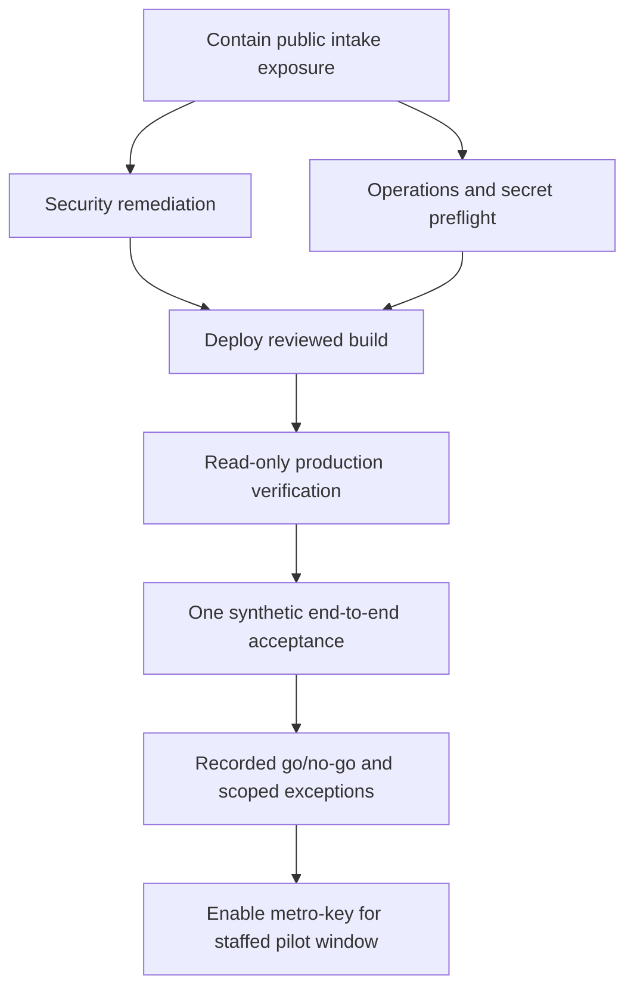

# Claude Code handoff: independent pilot-readiness critique

**Prepared:** 2026-09-20  
**Branch:** `logicacodecom/task-001-pilot-readiness`  
**Prepared from:** repository documentation, source, local verification, GitHub/Vercel status, and limited read-only production HTTP checks  
**Mode:** review only; do not modify application code, configuration, production data, or canonical readiness documents

## Assignment

Act as an independent technical critic of the current ClueXP pilot-readiness assessment. Focus on failure modes and weak assumptions in the proposed blocker priorities and execution order. Pay special attention to architecture, security, tenant isolation, dispatch safety, and operations.

First form your own blocker list from the evidence and referenced files below. Then compare it with Codex's provisional P0/P1/P2 classification. Do not accept a priority merely because Codex proposed it.

Return:

1. assumptions and scope;
2. findings ordered by severity, with file/line evidence;
3. blockers Codex missed, overstated, or understated;
4. explicit `accept`, `revise`, or `reject` judgments for each disputed decision;
5. dependencies and the smallest safe execution sequence;
6. unresolved risks or evidence that must be gathered before pilot go/no-go;
7. a final recommendation: `no-go`, `conditional go`, or `go`, with precise conditions.

Do not expose secrets, production identifiers, customer information, or private evidence-log contents. Do not perform production mutations. If current external state is unavailable, state exactly what must be verified instead of assuming it is safe.

## Pilot boundary to assess

The proposed first pilot is a time-boxed, continuously staffed, single-provider/single-tenant operating window for `metro-key`, with a primary dispatcher, backup dispatcher, and documented escalation path. Broader unattended or multi-tenant launch readiness is outside the immediate pilot boundary, but any shared-platform flaw that can affect this pilot remains in scope.

## Verified repository and CI state

- The working branch is based on current `origin/main` as observed on 2026-09-20.
- Pull request #75 was open, mergeable, and blocked on review. Its GitHub CI and Vercel preview checks were green; the latest observed checks were from 2026-09-03.
- Local API tests excluding the Postgres-only suite: **508 passed, 1 skipped**. One warning reports a duplicate FastAPI operation ID for `dispatch_sweep`.
- MCP tests: **37 passed**.
- OpenAPI drift check, Python compilation, shared TypeScript typecheck, and production builds for intake, technician, provider, and ops passed.
- The Postgres security suite was not rerun locally. The branch's green `api` CI job includes the Postgres-backed tests.
- No application code was changed during this review.

Treat green CI as necessary evidence, not as proof of production readiness.

## Evidence requiring priority judgment

### A. Public dispatch-phone fallback

- [`apps/intake-web/src/app/page.tsx`](../../apps/intake-web/src/app/page.tsx) defines:
  `process.env.NEXT_PUBLIC_DISPATCH_PHONE || "+18005551234"`.
- [`apps/intake-web/src/app/t/[token]/page.tsx`](../../apps/intake-web/src/app/t/%5Btoken%5D/page.tsx) uses the same public fallback.
- A read-only inspection of the current public production intake JavaScript on 2026-09-20 found the placeholder fallback in the served bundle.
- [`tasks.md`](tasks.md) records the production value/redeploy check as unfinished.
- [`spec.md`](spec.md) treats a dead or placeholder safety-call route as a life-safety-adjacent gap.
- The application also supports provider-specific `staffed_fallback_phone` data. Determine whether relying on a global build-time `NEXT_PUBLIC_DISPATCH_PHONE` is safe for the bounded pilot, whether provider-specific runtime data should be authoritative, and what the smallest safe containment is.

Codex's provisional judgment: **P0**. Do not allow intake traffic until a real staffed destination is confirmed in the built production artifact, or the intake channel is disabled.

### B. Next.js production dependency exposure

- The four web apps declare Next.js ranges beginning at `^16.0.7`.
- [`package-lock.json`](../../package-lock.json) resolves `next` to **16.2.6**.
- `npm audit --omit=dev` on 2026-09-20 reported **23 production dependency findings: 1 critical, 11 high, and 11 moderate**.
- The current advisory set included Next.js middleware/proxy authorization-bypass exposure below 16.2.11 and critical Windows development-server/image-optimizer issues below 16.3.3, plus transitive PostCSS and Sharp findings. Re-run the audit/advisory lookup before relying on these exact thresholds.
- Authenticated web apps use Next.js `src/proxy.ts` cookie guards. API endpoints also enforce server-side authentication and authorization.
- No explicit `next/image` imports were found in the reviewed source.

Codex's provisional judgment: **P0** to upgrade at least to a currently fixed supported release, rebuild all web apps, run auth/tenant-boundary regression checks, and verify previews before production promotion. Critique whether P0 is warranted for the bounded pilot, whether 16.3.3 is an adequate minimum, and the smallest defensible test matrix.

### C. Historical secret findings

- [`docs/AI-SDLC-WORKFLOW.md`](../../docs/AI-SDLC-WORKFLOW.md) states that PR secret scanning covers introduced commits and that GitHub secret scanning/push protection are enabled.
- The same document records four redacted full-history Gitleaks candidates awaiting Human/security triage. Their values must remain private.
- [`specs/000-orca-speckit-sdlc/tasks.md`](../000-orca-speckit-sdlc/tasks.md) leaves that triage open.
- No evidence in this review proves whether those candidates are false positives, expired credentials, or live production credentials.

Codex's provisional judgment: **P0 evidence gate**. A security owner must classify the findings and restrict/rotate any live credential before pilot. Critique whether this belongs at P0, what evidence would permit downgrading it, and whether containment can safely substitute for complete history-baseline work.

### D. Staffed manual operations versus automated alerting

- [`docs/PILOT-OPERATIONS.md`](../../docs/PILOT-OPERATIONS.md) defines readiness gates, primary and backup dispatchers, acknowledgment targets, stalled thresholds, after-hours fallback, and an escalation path.
- Its acceptance matrix records 15 of 16 scenarios as executed; the time-based auto-close scenario remains unexecuted.
- Its PO/Operations/Engineering sign-off checklist remains unchecked.
- It records operational gaps in alert delivery. Current alerting is largely pull/poll based; the cron does not provide a reliable human page for an unattended dispatcher.

Codex's provisional judgment: a strictly time-boxed, continuously staffed pilot may proceed with documented manual polling, dual coverage, and an explicit stop rule. Reliable unattended paging is **P1 before any unattended or extended-hours pilot**, not necessarily P0 for the bounded staffed window. Critique the assumptions and specify the polling/acknowledgment evidence and failure threshold required for that exception.

### E. Production preflight and sign-off

- [`docs/PRODUCTION-READINESS.md`](../../docs/PRODUCTION-READINESS.md) requires production environment/secrets verification, cron state, staffed fallback, and other deployment checks.
- [`docs/PILOT-OPERATIONS.md`](../../docs/PILOT-OPERATIONS.md) still shows final sign-offs as incomplete.
- Green previews do not establish that production environment values, cron delivery, operator credentials, rollback controls, and live tenant state are correct today.

Codex's provisional judgment: **P0**. Complete a read-only production preflight, then one synthetic end-to-end acceptance during the staffed window, before admitting real pilot traffic.

### F. MCP health monitor mismatch

- Read-only production checks returned `200` for MCP health and `401` for both missing and incorrect credentials, with the secure OAuth-style body `{"error":"invalid_token","error_description":"Authentication required"}`.
- [`.github/workflows/mcp-production-health.yml`](../../.github/workflows/mcp-production-health.yml) still expects the old string `invalid_mcp_token` for those negative checks.
- The last ten observed scheduled workflow runs failed on this assertion even though the endpoint rejected unauthorized access.

Codex's provisional judgment: **P1 operational observability defect**, not a core P0 for the bounded dispatch pilot. The monitor should be updated and shown green before treating MCP monitoring as trustworthy. Critique whether any ChatGPT/MCP use is part of the pilot critical path and would promote this to P0.

### G. Documentation drift

- [`docs/HANDOFF.md`](../../docs/HANDOFF.md) records that the real stale job discovered during the July smoke test was closed on 2026-07-13 through the supported resolve path.
- [`docs/EXECUTION-PLAN.md`](../../docs/EXECUTION-PLAN.md) and parts of [`docs/PILOT-OPERATIONS.md`](../../docs/PILOT-OPERATIONS.md) still describe that job or related risk as open.
- The implementation contains a global technician-capacity transaction lock using `pg_advisory_xact_lock` in [`apps/intake-web/api/store.py`](../../apps/intake-web/api/store.py), with regression coverage, while canonical documents still describe the lock as missing.

Codex's provisional judgment: **P1 governance/review blocker** and a source of misleading go/no-go decisions, but not itself an unsafe runtime condition after production state is verified. Correct canonical documents and close/replace PR #75 after the substantive P0 evidence is known.

### H. Remaining acceptance and deferred scope

- The 72-hour auto-close timing scenario is not executed against a natural production-duration timer.
- Exact identities for any additional "stale demo jobs" are not present in the repository. No bulk cleanup should occur without proving each record is synthetic and tenant-scoped.
- Native APNs/FCM delivery and physical-device QA may be deferred if the pilot contract uses the web/PWA technician path and operators understand that boundary.
- Google Routes enhancements and external platform/listing work do not appear necessary for the bounded dispatch pilot.

Codex's provisional judgment: these are **P2** for the bounded pilot, subject to explicit scope exceptions. Challenge any item that can corrupt state, strand a customer, violate capacity rules, or make the staffed pilot unrecoverable.

## Proposed dependency structure



Security remediation currently includes the Next.js patch and historical-secret disposition. Operations preflight includes the staffed phone, operator coverage, environment/secrets presence, cron state, tenant state, rollback/kill switch, and escalation ownership.

## Codex's provisional smallest safe sequence

1. **Contain exposure now.** Keep public intake disabled or behind the existing kill switch until the served production artifact shows a verified staffed dispatch destination.
2. **Run two parallel preparation tracks.** Engineering patches Next.js and validates all four web apps; Operations/Security verifies the staffed phone, production variables, operator access, historical secret findings, cron state, and stop/rollback controls.
3. **Review and deploy the minimum fix set.** Require the repository's secondary-review and CI gates for security/config/deployment changes.
4. **Perform read-only production preflight.** Confirm deployed version, tenant isolation/config, operator access, phone behavior, job queue state, and monitoring behavior without exposing private values.
5. **Run one synthetic end-to-end job.** Exercise intake, dispatch offer/acceptance, arrival/PIN, completion, customer confirmation or an approved shortened auto-close check, recovery visibility, and audit evidence during the staffed window.
6. **Record sign-off and exceptions.** Product, Operations, and Engineering explicitly accept only time-bounded exceptions, each with owner, expiry, and stop condition.
7. **Enable only the `metro-key` pilot boundary.** Admit real traffic only during the staffed window; stop on missed acknowledgment, dead safety-contact behavior, auth/tenant-boundary failure, stuck lifecycle state, or loss of operator coverage.

## Questions Claude must answer

1. Is the dispatch-phone containment correctly P0? Is a global build-time phone architecture acceptable for this pilot, or must the provider-specific runtime phone be used before launch?
2. Is Next.js 16.2.6 an immediate P0 under this threat model? What exact supported target and regression boundary are defensible after checking current official advisories?
3. Must all four historical secret candidates be fully triaged before the bounded pilot? What concrete containment evidence, if any, permits a conditional go?
4. Can manual polling safely cover alerts for a continuously staffed window? Define maximum polling interval, acknowledgment target, backup takeover, loss-of-coverage stop rule, and required rehearsal evidence.
5. Is the MCP scheduled-monitor failure relevant to the pilot's critical path, or can it remain P1?
6. Does the incomplete 72-hour auto-close scenario block real pilot traffic? If not, what shortened or deterministic evidence is sufficient?
7. What blocker is missing from this assessment? Inspect auth/tenant boundaries, dispatch state transitions, capacity locking, operator recovery, production configuration, and rollout/rollback assumptions.
8. Is the proposed dependency order minimal, or can it be shortened without accepting an unbounded safety or security risk?

## Response template

```markdown
# Claude independent critique

## Scope and assumptions

## Findings

### P0
- Finding, evidence, impact, required closure proof

### P1
- Finding, evidence, impact, required closure proof

### P2
- Finding, evidence, impact, required closure proof

## Decision review
| Decision | Accept / revise / reject | Reason | Required evidence or change |
|---|---|---|---|

## Dependencies and smallest safe sequence
1. ...

## Missing evidence and unresolved risks

## Recommendation
`no-go`, `conditional go`, or `go`, followed by exact conditions.
```

